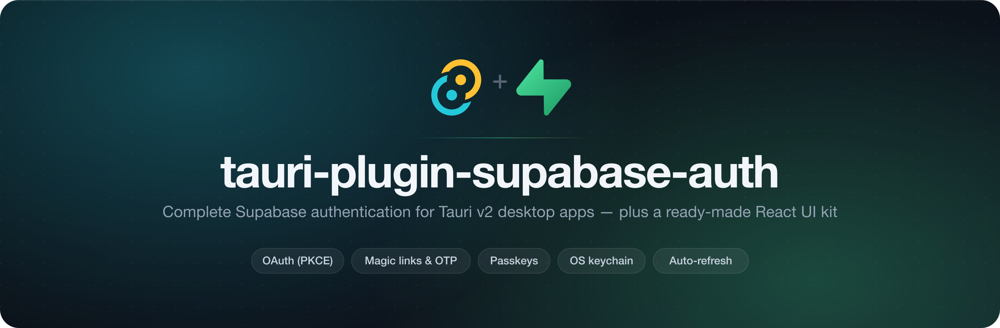
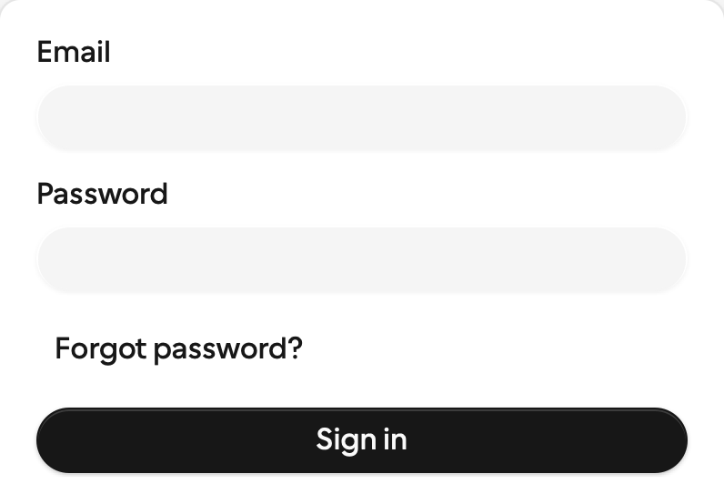
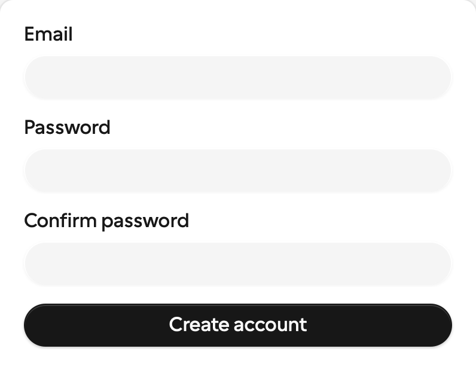
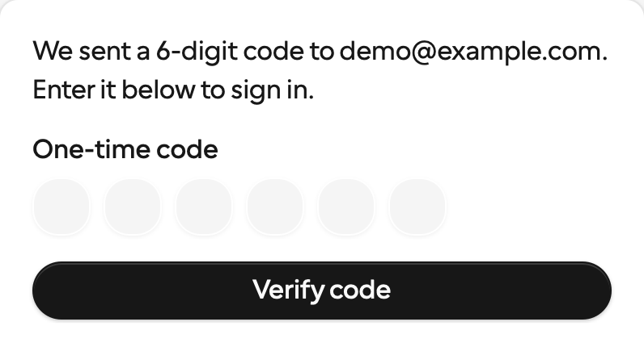
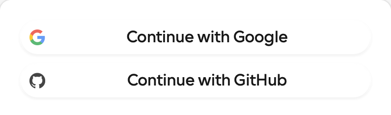
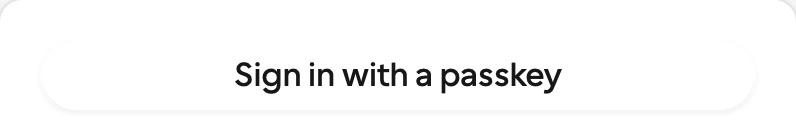
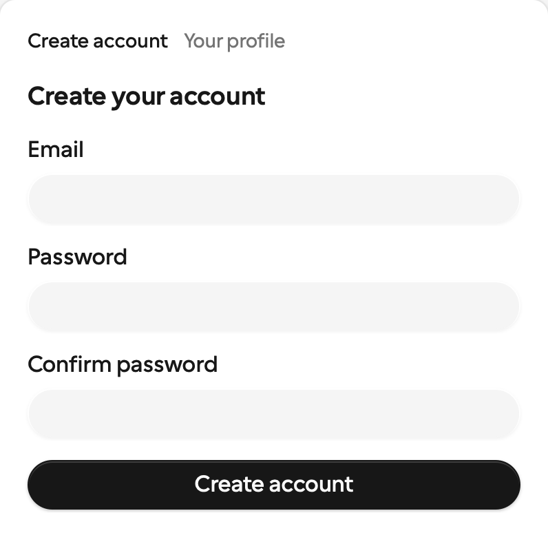
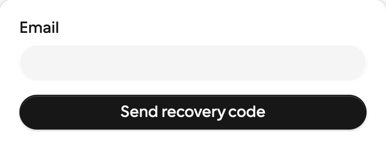
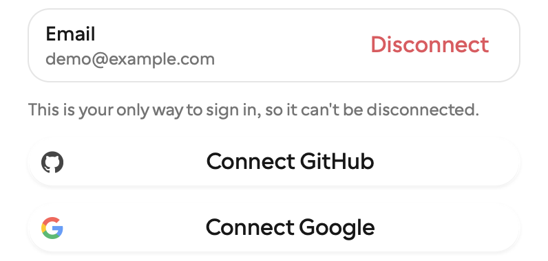
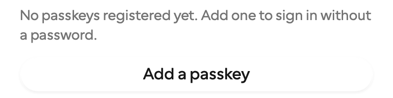

<div align="center">



---

[](https://github.com/exegia/corpora-auth/actions/workflows/ci.yml)
[](#-license)
[](https://v2.tauri.app)
[](https://supabase.com/docs/guides/auth)

Email/password &nbsp;·&nbsp; Magic links & one-time codes &nbsp;·&nbsp; OAuth via system browser (PKCE) &nbsp;·&nbsp; Passkeys &nbsp;·&nbsp; Password recovery &nbsp;·&nbsp; Persistent auto-refreshing sessions &nbsp;·&nbsp; OS-keychain storage

**[Documentation](./docs)** &nbsp;·&nbsp; [Quickstart](./docs/quickstart.mdx) &nbsp;·&nbsp; [UI kit](./docs/components/overview.mdx) &nbsp;·&nbsp; [JavaScript API](./docs/plugin/javascript-api.mdx)

</div>

---

## Why this plugin?

Desktop auth is fiddly: token storage that isn't a plain-text JSON file, OAuth redirects without a web server, sessions that survive restarts, refreshes that never race a sign-out. This plugin does all of it **once**, and exposes the result to **both sides of your app**:

|                          |                                                                                        |
| ------------------------ | -------------------------------------------------------------------------------------- |
| 🦀 **Rust side**         | `app.supabase_auth().sign_in_with_password(..)`, full sessions, state-change callbacks |
| 🌐 **Frontend side**     | `@exegia/plugin-supabase-auth` typed bindings + push events (no polling)               |
| 🎨 **UI kit**            | `@exegia/auth-ui` — coss ui blocks: sign-in, sign-up, OTP, recovery, social, passkeys  |
| 🔑 **Secure by default** | Sessions in the OS keychain; the webview **never sees the refresh token**              |
| 🛡️ **Permission model**  | Safe default command set; account mutations are explicit opt-ins                       |
| 🧪 **Tested**            | Rust contract tests, UI tests including accessibility, live-stack E2E in CI            |

## 🚀 Quickstart

**1. The plugin (Rust)**

```toml
# src-tauri/Cargo.toml
[dependencies]
tauri-plugin-supabase-auth = { git = "https://github.com/exegia/corpora-auth" }
```

```rust
// src-tauri/src/lib.rs
tauri::Builder::default()
    .plugin(tauri_plugin_supabase_auth::init())
```

**2. The frontend packages**

The npm packages live on GitHub Packages, so point the `@exegia` scope there:

```ini
# .npmrc (project root)
@exegia:registry=https://npm.pkg.github.com
//npm.pkg.github.com/:_authToken=${GITHUB_TOKEN}   # any token with read:packages
```

```bash
bun add @exegia/plugin-supabase-auth
bun add @exegia/auth-ui        # optional: the UI kit
```

**3. Your Supabase project**

```jsonc
// src-tauri/tauri.conf.json
{
  "plugins": {
    "supabase-auth": {
      "url": "https://<project>.supabase.co",
      "publishableKey": "<publishable-or-anon-key>", // NEVER the service-role key
    },
  },
}
```

That's the minimum — persistence, refresh timing and OAuth ports all have defaults. See [Configuration](./docs/plugin/configuration.mdx).

> ⚡ Config is validated **at startup** — a typo aborts launch with a message naming the exact field, instead of a mysterious failure at first sign-in.

**4. Permissions**

```jsonc
// src-tauri/capabilities/default.json
{
  "permissions": ["core:default", "supabase-auth:default"],
}
```

`supabase-auth:default` covers the everyday lifecycle. Account mutations — password reset, profile updates, identity linking, passkey management — are deliberately excluded and opted into by name. See [Permissions](./docs/plugin/permissions.mdx).

**5. Sign someone in**

```tsx
import { SignInForm, useSession } from "@exegia/auth-ui";
import "@exegia/auth-ui/styles.css";

export default function App() {
  const { status, user } = useSession();

  if (status === "loading") return <p>Restoring session…</p>;
  if (status === "signedIn") return <p>Hello {user?.email} 👋</p>;

  return <SignInForm showSocial={["github", "google"]} />;
}
```

Or call the bindings directly:

```ts
import {
  signInWithPassword,
  onAuthStateChange,
} from "@exegia/plugin-supabase-auth";

await signInWithPassword({ email, password }); // → Session (never carries the refresh token)

const unlisten = await onAuthStateChange(({ event, session }) => {
  // "SIGNED_IN" | "SIGNED_OUT" | "TOKEN_REFRESHED" | "PASSWORD_RECOVERY" | …
});
```

And from Rust, symmetrically:

```rust
use tauri_plugin_supabase_auth::SupabaseAuthExt;

let auth = app.supabase_auth();
let session = auth.sign_in_with_password("a@b.co", "hunter22").await?;
auth.on_auth_state_change(|payload| println!("auth: {:?}", payload.event));
```

## 🎨 The UI kit

Drop-in React blocks built on hooks that talk to the plugin directly — no provider to mount. Every block validates with zod before the first network call, renders explicit loading/success/error states, is keyboard- and screen-reader-operable (axe-tested), and lets you override any user-facing string.

Every screenshot is the real block, captured from `examples/tauri-app` against a local Supabase — cropped to the block, no mockups.

|                                                                                                                                                  |                                                                                                                                                                             |                                                                                                                                                      |
| :----------------------------------------------------------------------------------------------------------------------------------------------: | :-------------------------------------------------------------------------------------------------------------------------------------------------------------------------: | :--------------------------------------------------------------------------------------------------------------------------------------------------: |
|  |                            |        |
|                                           [`<SignInForm />`](./docs/components/sign-in.mdx#signinform)                                           |                                                        [`<SignUpForm />`](./docs/components/sign-up.mdx#signupform)                                                         |                                                [`<OtpForm />`](./docs/components/sign-in.mdx#otpform)                                                |
|               |                                                        |                   |
|                                        [`<SocialButtons />`](./docs/components/sign-in.mdx#socialbuttons)                                        |                                                     [`<PasskeySignIn />`](./docs/components/sign-in.mdx#passkeysignin)                                                      |                                         [`<OnboardingFlow />`](./docs/components/sign-up.mdx#onboardingflow)                                         |
|           |  |  |
|                                   [`<ForgotPasswordForm />`](./docs/components/account.mdx#forgotpasswordform)                                   |                                                    [`<LinkedAccounts />`](./docs/components/account.mdx#linkedaccounts)                                                     |                                         [`<PasskeyManager />`](./docs/components/account.mdx#passkeymanager)                                         |

Also `<UpdatePasswordForm />`, the hooks the blocks are built on (`useSession`, `useAuth`, `useIdentities`, `usePasskeys`, the onboarding pair), and the coss primitives underneath. Props, permissions and behaviour for all of it: **[UI kit documentation](./docs/components/overview.mdx)**.

**The design language:** pill geometry throughout, self-hosted Cal Sans 2.0 scoped to `[data-slot="auth-block"]`, inline provider brand marks, and spring motion on the [transitions.dev](https://transitions.dev) token scale — all behind `prefers-reduced-motion`. The kit ships no colours of its own; swapping the shadcn-style surface tokens re-skins every block at once.

> **Consuming the kit from your own Tailwind app?** Add `@source "../node_modules/@exegia/auth-ui/dist";` next to the `@import`, or utilities used only inside the kit are never generated.

## 📚 Documentation

The full docs are a [Mintlify](https://mintlify.com) site in [`docs/`](./docs) — run `mint dev` there for a local preview.

|                                                    |                                                         |
| -------------------------------------------------- | ------------------------------------------------------- |
| [Quickstart](./docs/quickstart.mdx)                | Install, configure, sign someone in                     |
| [Configuration](./docs/plugin/configuration.mdx)   | Every option, its default, and what it changes          |
| [Permissions](./docs/plugin/permissions.mdx)       | The default set, and the opt-in account mutations       |
| [Provider setup](./docs/plugin/provider-setup.mdx) | GitHub, Google, account linking, passkey prerequisites  |
| [JavaScript API](./docs/plugin/javascript-api.mdx) | Every binding and the auth-state event stream           |
| [Rust API](./docs/plugin/rust-api.mdx)             | `SupabaseAuthExt`, listeners, custom ceremony providers |
| [Errors](./docs/plugin/errors.mdx)                 | The 16 `AuthError` kinds and what to do about each      |
| [OAuth](./docs/plugin/oauth.mdx)                   | Loopback + PKCE, and what to allow-list                 |
| [Passkeys](./docs/plugin/passkeys.mdx)             | The ceremony seam, platform support, project setup      |
| [Components](./docs/components/overview.mdx)       | Blocks, hooks and primitives                            |

## 🔒 Guarantees worth knowing

- **Refresh tokens never reach the webview.** Frontend sessions are sanitized; only Rust sees the full session.
- **No zombie sessions.** All mutations serialize through one lock — a sign-out racing a background refresh always ends fully signed out.
- **Offline-friendly.** Launching offline with an unexpired stored session keeps you signed in; refresh retries in the background. Corrupt or revoked stored sessions degrade to signed-out, never a crash.
- **Nothing hangs.** Every call resolves or rejects within a 15 s network budget — a stalled request surfaces as `network`, not a pending promise.

## 🕹️ Try the example app

```bash
git clone https://github.com/exegia/corpora-auth && cd corpora-auth
make setup                             # bun install + toolchain preflight
make supabase-up                       # local stack; mail UI at http://127.0.0.1:54324
make -C examples/tauri-app dev
```

The example wires every block to the local stack out of the box — see [examples/tauri-app](./examples/tauri-app).

Email/password, magic links and one-time codes work against a fresh `make supabase-up` with no credentials at all. OAuth, account linking and passkeys need configuration only you can supply — the example's error screen names the relevant setup step, and [Provider setup](./docs/plugin/provider-setup.mdx) lists them all.

## 🗺️ Roadmap

- [x] **Account linking** — attach OAuth identities to an existing email account (`<LinkedAccounts />`)
- [x] **Sign-up onboarding steps** — collect profile info (`user_metadata`) in a multi-step block (`<OnboardingFlow />`)
- [x] **Passkeys** — WebAuthn sign-in and management, with built-in macOS and Windows ceremonies
- [ ] **MFA / TOTP** — enrollment + challenge blocks once the underlying flows stabilize
- [ ] **Deep-link OAuth** — custom-scheme return path as an alternative to loopback
- [ ] **crates.io release** — currently consumed as a git dependency
- [ ] Tauri **mobile** targets (iOS/Android)

## 🛠️ Development

`make` at the repo root lists every task. The common loop:

```bash
make setup                # bun install + toolchain preflight
make supabase-up          # local stack; mail UI at http://127.0.0.1:54324
make test                 # Rust suite + UI tests
make check                # cargo fmt --check, clippy, tsc --noEmit
```

| Target                                                     | What it does                                                                |
| ---------------------------------------------------------- | --------------------------------------------------------------------------- |
| `make build`                                               | Every publishable artifact: bindings → UI kit → crate package check         |
| `make build:bindings` / `build:ui`                         | The two npm packages (`@exegia/plugin-supabase-auth`, `@exegia/auth-ui`)    |
| `make build:plugin`                                        | `cargo publish --dry-run` + a report of what ships in the crate tarball     |
| `make pack`                                                | npm tarballs into `dist-packages/` so you can inspect them before a release |
| `make test:rust` / `test:ui` / `test:e2e` / `test:example` | One suite at a time                                                         |
| `make clean` / `clean:build` / `clean:dry`                 | Remove everything generated / build output only / just report               |

`test:ui` builds the bindings first — the UI suite resolves `@exegia/plugin-supabase-auth` through `guest-js/dist`, so it fails on a fresh checkout without that step.

Publishing stays in [`.github/workflows/release.yml`](./.github/workflows/release.yml), which bumps all three versions in lockstep and pushes both npm packages to GitHub Packages. The `build:*` targets only verify that a release would work.

The example app has its own task runner: `make -C examples/tauri-app help`. Design docs (spec, plan, research, contracts) live in [`specs/`](./specs).

## 📄 License

Licensed under either of [Apache License, Version 2.0](./LICENSE-APACHE) or [MIT license](./LICENSE-MIT) at your option.

Unless you explicitly state otherwise, any contribution intentionally submitted for inclusion in this work by you, as defined in the Apache-2.0 license, shall be dual licensed as above, without any additional terms or conditions.
