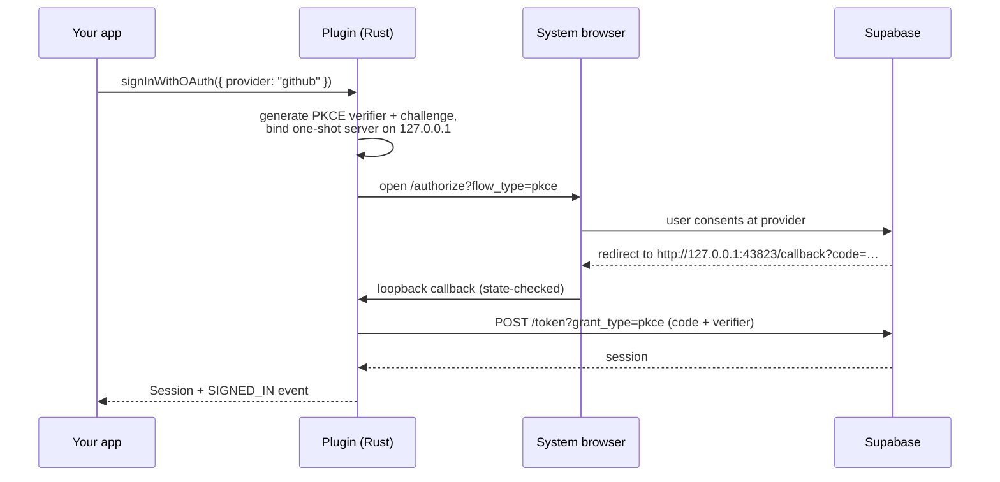

<div align="center">

# 🔐 tauri-plugin-supabase-auth

**Complete Supabase authentication for Tauri v2 desktop apps** — plus a ready-made React auth UI kit.

[](https://github.com/exegia/corpora-auth/actions/workflows/ci.yml)
[](#-license)
[](https://v2.tauri.app)
[](https://supabase.com/docs/guides/auth)

Email/password &nbsp;·&nbsp; Magic links & one-time codes &nbsp;·&nbsp; OAuth via system browser (PKCE) &nbsp;·&nbsp; Password recovery &nbsp;·&nbsp; Persistent auto-refreshing sessions &nbsp;·&nbsp; OS-keychain storage

</div>

---

## Why this plugin?

Desktop auth is fiddly: token storage that isn't a plain-text JSON file, OAuth redirects without a web server, sessions that survive restarts, refreshes that never race a sign-out. This plugin does all of it **once**, and exposes the result to **both sides of your app**:

| | |
|---|---|
| 🦀 **Rust side** | `app.supabase_auth().sign_in_with_password(..)`, full sessions, state-change callbacks |
| 🌐 **Frontend side** | `@exegia/plugin-supabase-auth` typed bindings + push events (no polling) |
| 🎨 **UI kit** | `@exegia/auth-ui` — coss ui blocks: sign-in, sign-up, OTP, recovery, social buttons |
| 🔑 **Secure by default** | Sessions in the OS keychain; the webview **never sees the refresh token** |
| 🛡️ **Permission model** | Safe default command set; account mutations are explicit opt-ins |
| 🧪 **Tested** | 40 Rust contract tests, 44 UI tests (incl. accessibility), live-stack E2E in CI |

## 🚀 Quickstart

### 1. Install the plugin (Rust)

```toml
# src-tauri/Cargo.toml
[dependencies]
tauri-plugin-supabase-auth = { git = "https://github.com/exegia/corpora-auth" }
```

```rust
// src-tauri/src/lib.rs
tauri::Builder::default()
    .plugin(tauri_plugin_supabase_auth::init())
    // ...
```

### 2. Install the bindings (frontend)

The npm package lives on GitHub Packages, so point the `@exegia` scope there:

```ini
# .npmrc (project root)
@exegia:registry=https://npm.pkg.github.com
//npm.pkg.github.com/:_authToken=${GITHUB_TOKEN}   # any token with read:packages
```

```bash
pnpm add @exegia/plugin-supabase-auth
pnpm add @exegia/auth-ui        # optional: the UI kit
```

### 3. Configure your Supabase project

```jsonc
// src-tauri/tauri.conf.json
{
  "plugins": {
    "supabase-auth": {
      "url": "https://<project>.supabase.co",
      "publishableKey": "<publishable-or-anon-key>"   // NEVER the service-role key
    }
  }
}
```

That's the minimum. Everything else has sensible defaults:

| Option | Default | What it does |
|---|---|---|
| `sessionPersistence` | `"keychain"` | `"keychain"` (OS credential store) · `"file"` (app data dir, `0600`) · `"none"` |
| `autoRefresh` | `true` | Refresh sessions in the background before they expire |
| `refreshBufferSecs` | `60` | How early to refresh |
| `oauth.callbackPorts` | `[43823, 43824, 43825]` | Loopback ports for the OAuth redirect |
| `oauth.flowTimeoutSecs` | `300` | Abandoned browser round-trips fail after this |

> ⚡ Config is validated **at startup** — a typo aborts launch with a message naming the exact field, instead of a mysterious failure at first sign-in.

### 4. Grant permissions

```jsonc
// src-tauri/capabilities/default.json
{
  "permissions": [
    "core:default",
    "supabase-auth:default"
  ]
}
```

`supabase-auth:default` covers the everyday lifecycle (sign-up, sign-in via password/OTP/OAuth, sign-out, session queries, refresh). Account-mutating commands are deliberately **excluded** and must be opted into:

```jsonc
"supabase-auth:allow-reset-password-for-email",
"supabase-auth:allow-update-user",
"supabase-auth:allow-get-identities",     // account linking (view)
"supabase-auth:allow-link-identity",      // account linking (connect)
"supabase-auth:allow-unlink-identity"     // account linking (disconnect)
```

### 5. Sign someone in

**Fastest path — drop in a block:**

```tsx
import { SignInForm, useSession } from "@exegia/auth-ui";
import "@exegia/auth-ui/styles.css";

export default function App() {
  const { status, user } = useSession();

  if (status === "loading")  return <p>Restoring session…</p>;
  if (status === "signedIn") return <p>Hello {user?.email} 👋</p>;

  return (
    <SignInForm
      showSocial={["github", "google"]}
      onForgotPassword={() => {/* route to <ForgotPasswordForm /> */}}
    />
  );
}
```

**Or call the bindings directly:**

```ts
import {
  signUp, signInWithPassword, signOut, getSession,
  onAuthStateChange, isAuthError,
} from "@exegia/plugin-supabase-auth";

await signUp({ email, password });                 // → { status: "signedIn" | "pendingConfirmation", session? }
await signInWithPassword({ email, password });     // → Session (never contains the refresh token)

const unlisten = await onAuthStateChange(({ event, session }) => {
  // "SIGNED_IN" | "SIGNED_OUT" | "TOKEN_REFRESHED" | "PASSWORD_RECOVERY" | "IDENTITIES_CHANGED"
});
```

**And from Rust, symmetrically:**

```rust
use tauri_plugin_supabase_auth::SupabaseAuthExt;

let auth = app.supabase_auth();
let session = auth.sign_in_with_password("a@b.co", "hunter22").await?;
auth.on_auth_state_change(|payload| println!("auth: {:?}", payload.event));
```

## 🧭 The full surface

### Frontend bindings (`@exegia/plugin-supabase-auth`)

| Function | Notes |
|---|---|
| `signUp({ email, password, data? })` | Reports `pendingConfirmation` when the project requires email confirmation |
| `signInWithPassword({ email, password })` | |
| `signInWithOtp({ email \| phone, redirectTo? })` | Sends a magic link / one-time code |
| `verifyOtp({ email \| phone, token, type })` | `type: "email" \| "sms" \| "recovery"` |
| `signInWithOAuth({ provider, scopes? })` | Opens the **system browser**; resolves when the round-trip completes |
| `cancelOAuthFlow()` | Aborts an in-flight browser round-trip |
| `signOut()` | Local-first: state clears even if the network is down |
| `getSession()` / `getUser()` | On-demand state |
| `refreshSession()` | Manual refresh (background refresh is automatic) |
| `resetPasswordForEmail({ email })` | Opt-in permission |
| `updateUser({ email?, password?, data? })` | Opt-in permission |
| `getIdentities()` | Lists the sign-in identities on the account · opt-in permission |
| `linkIdentity({ provider, scopes? })` | Attaches a provider identity to the **current** account via the system browser · opt-in permission |
| `unlinkIdentity({ identityId })` | Disconnects an identity (the last sign-in method is refused) · opt-in permission |
| `onAuthStateChange(cb)` | Push events — no polling |

Every rejection is a structured `{ kind, message, retryAfterSecs? }` — check with `isAuthError(e)`. Kinds: `invalidCredentials` · `emailAlreadyRegistered` · `emailNotConfirmed` · `otpExpired` · `network` · `configuration` · `sessionExpired` · `oauthFlowInterrupted` · `rateLimited` · `permissionDenied` · `identityAlreadyLinked` · `lastSignInMethod` · `unknown`. **No operation hangs** — everything resolves or fails within a 15 s network budget.

### UI kit blocks (`@exegia/auth-ui`)

| Block | Flow |
|---|---|
| `<SignInForm />` | Email + password, optional social buttons, forgot-password link |
| `<SignUpForm />` | With confirm-password and "check your inbox" state |
| `<OtpForm />` | Two steps: request code → redeem in a segmented OTP field |
| `<ForgotPasswordForm />` | Request reset → redeem emailed recovery code **in-app** → hand off to password update |
| `<UpdatePasswordForm />` | Signed-in password change |
| `<SocialButtons />` | Per-provider buttons with in-flight/cancel handling |
| `<OnboardingFlow />` | Multi-step sign-up: credentials → confirmation waiting state → declared profile steps, resumable via `user_metadata` (needs `allow-update-user`) |
| `<LinkedAccounts />` | Settings block: lists connected identities, connect/disconnect with in-flight & last-method safeguards (needs the three identity permissions + manual linking enabled) |

All blocks: zod validation before any network call, loading/success/error states, keyboard- and screen-reader-operable (axe-tested), user-facing error messages overridable per block via `errorMessages`.

### How the desktop OAuth flow works



Loopback + PKCE is the provider-sanctioned native-app pattern (Google and GitHub reject custom URI schemes as redirect targets). Add `http://127.0.0.1:43823/callback` to your provider's redirect allow-list.

### Guarantees worth knowing

- 🔒 **Refresh tokens never reach the webview.** Frontend sessions are sanitized; only Rust sees the full session.
- 🔁 **No zombie sessions.** All mutations serialize through one lock — a sign-out racing a background refresh always ends fully signed out.
- ✈️ **Offline-friendly.** Launching offline with an unexpired stored session keeps you signed in; refresh retries in the background. Corrupt or revoked stored sessions degrade to signed-out — never a crash.

## 🕹️ Try the example app

```bash
git clone https://github.com/exegia/corpora-auth && cd corpora-auth
supabase init && supabase start        # local stack; mail UI at http://127.0.0.1:54324
pnpm install
pnpm --filter tauri-app tauri dev
```

The example wires every block to the local stack out of the box — see [examples/tauri-app](./examples/tauri-app).

## 🗺️ Roadmap

- [x] **Account linking** — attach OAuth identities to an existing email account (`<LinkedAccounts />`)
- [x] **Sign-up onboarding steps** — collect profile info (`user_metadata`) in a multi-step block (`<OnboardingFlow />`)
- [ ] **MFA / TOTP** — enrollment + challenge blocks once the underlying flows stabilize
- [ ] **Deep-link OAuth** — custom-scheme return path as an alternative to loopback
- [ ] **crates.io release** — currently consumed as a git dependency
- [ ] Tauri **mobile** targets (iOS/Android)

## 🛠️ Development

```bash
cargo test                              # 40 Rust contract tests (wiremock GoTrue)
pnpm install && pnpm -r build
pnpm --filter @exegia/auth-ui test      # 44 UI tests incl. accessibility
pnpm test:e2e                           # lifecycle E2E vs a live stack (SUPABASE_E2E_URL / SUPABASE_E2E_KEY)
```

Design docs (spec, plan, research, contracts) live in [`specs/001-supabase-auth-plugin/`](./specs/001-supabase-auth-plugin).

## 📄 License

Licensed under either of [Apache License, Version 2.0](./LICENSE-APACHE) or [MIT license](./LICENSE-MIT) at your option.

Unless you explicitly state otherwise, any contribution intentionally submitted for inclusion in this work by you, as defined in the Apache-2.0 license, shall be dual licensed as above, without any additional terms or conditions.
