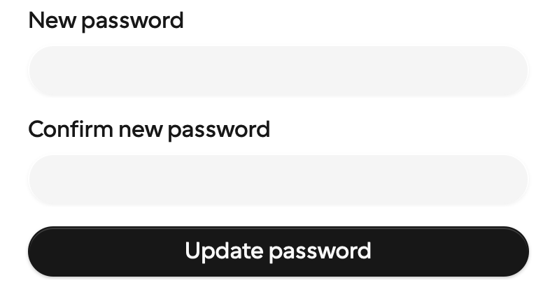
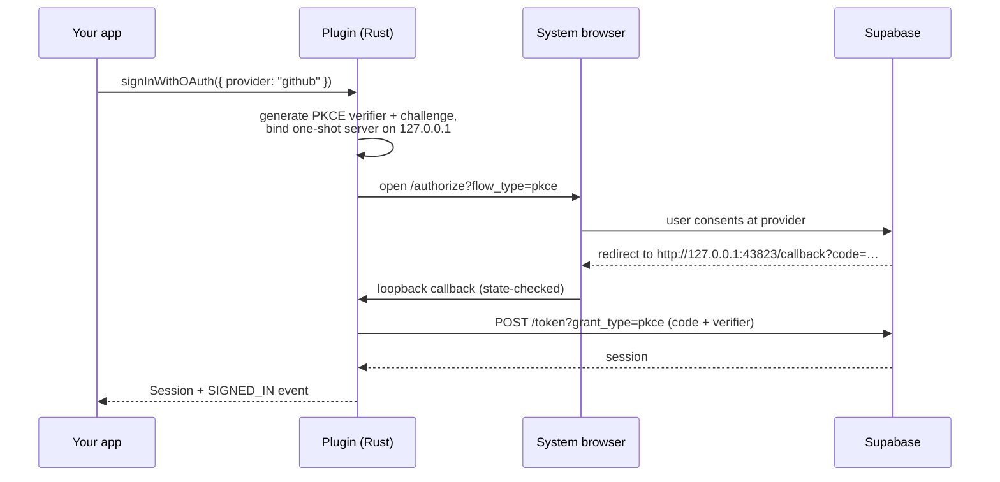

<div align="center">


---

[](https://github.com/exegia/corpora-auth/actions/workflows/ci.yml)
[](#-license)
[](https://v2.tauri.app)
[](https://supabase.com/docs/guides/auth)

Email/password &nbsp;·&nbsp; Magic links & one-time codes &nbsp;·&nbsp; OAuth via system browser (PKCE) &nbsp;·&nbsp; Password recovery &nbsp;·&nbsp; Persistent auto-refreshing sessions &nbsp;·&nbsp; OS-keychain storage

</div>

---

## Why this plugin?

Desktop auth is fiddly: token storage that isn't a plain-text JSON file, OAuth redirects without a web server, sessions that survive restarts, refreshes that never race a sign-out. This plugin does all of it **once**, and exposes the result to **both sides of your app**:

|                          |                                                                                        |
| ------------------------ | -------------------------------------------------------------------------------------- |
| 🦀 **Rust side**         | `app.supabase_auth().sign_in_with_password(..)`, full sessions, state-change callbacks |
| 🌐 **Frontend side**     | `@exegia/plugin-supabase-auth` typed bindings + push events (no polling)               |
| 🎨 **UI kit**            | `@exegia/auth-ui` — coss ui blocks: sign-in, sign-up, OTP, recovery, social buttons    |
| 🔑 **Secure by default** | Sessions in the OS keychain; the webview **never sees the refresh token**              |
| 🛡️ **Permission model**  | Safe default command set; account mutations are explicit opt-ins                       |
| 🧪 **Tested**            | 40 Rust contract tests, 44 UI tests (incl. accessibility), live-stack E2E in CI        |

## 🚀 Quickstart

### 1. Install the plugin (Rust)

```toml
# src-tauri/Cargo.toml
[dependencies]
tauri-plugin-supabase-auth = { git = "https://github.com/exegia/corpora-auth" }
```

```rust
// src-tauri/src/lib.rs
tauri::Builder::default()
    .plugin(tauri_plugin_supabase_auth::init())
    // ...
```

### 2. Install the bindings (frontend)

The npm package lives on GitHub Packages, so point the `@exegia` scope there:

```ini
# .npmrc (project root)
@exegia:registry=https://npm.pkg.github.com
//npm.pkg.github.com/:_authToken=${GITHUB_TOKEN}   # any token with read:packages
```

```bash
bun add @exegia/plugin-supabase-auth
bun add @exegia/auth-ui        # optional: the UI kit
```

### 3. Configure your Supabase project

```jsonc
// src-tauri/tauri.conf.json
{
  "plugins": {
    "supabase-auth": {
      "url": "https://<project>.supabase.co",
      "publishableKey": "<publishable-or-anon-key>", // NEVER the service-role key
    },
  },
}
```

That's the minimum. Everything else has sensible defaults:

| Option                  | Default                 | What it does                                                                    |
| ----------------------- | ----------------------- | ------------------------------------------------------------------------------- |
| `sessionPersistence`    | `"keychain"`            | `"keychain"` (OS credential store) · `"file"` (app data dir, `0600`) · `"none"` |
| `autoRefresh`           | `true`                  | Refresh sessions in the background before they expire                           |
| `refreshBufferSecs`     | `60`                    | How early to refresh                                                            |
| `oauth.callbackPorts`   | `[43823, 43824, 43825]` | Loopback ports for the OAuth redirect                                           |
| `oauth.flowTimeoutSecs` | `300`                   | Abandoned browser round-trips fail after this                                   |

> ⚡ Config is validated **at startup** — a typo aborts launch with a message naming the exact field, instead of a mysterious failure at first sign-in.

### 4. Grant permissions

```jsonc
// src-tauri/capabilities/default.json
{
  "permissions": ["core:default", "supabase-auth:default"],
}
```

`supabase-auth:default` covers the everyday lifecycle (sign-up, sign-in via password/OTP/OAuth, sign-out, session queries, refresh). Account-mutating commands are deliberately **excluded** and must be opted into:

```jsonc
"supabase-auth:allow-reset-password-for-email",
"supabase-auth:allow-update-user",
"supabase-auth:allow-get-identities",     // account linking (view)
"supabase-auth:allow-link-identity",      // account linking (connect)
"supabase-auth:allow-unlink-identity",    // account linking (disconnect)

// Passkeys (beta) — grant the sign-in and management surfaces independently:
"supabase-auth:allow-get-passkey-capability",
"supabase-auth:allow-sign-in-with-passkey",         // sign-in surface
"supabase-auth:allow-register-passkey",             // management surface…
"supabase-auth:allow-list-passkeys",
"supabase-auth:allow-rename-passkey",
"supabase-auth:allow-delete-passkey",
// …and the two-step surface, only if the app runs its own WebAuthn ceremony:
"supabase-auth:allow-passkey-registration-options",
"supabase-auth:allow-passkey-registration-verify",
"supabase-auth:allow-passkey-authentication-options",
"supabase-auth:allow-passkey-authentication-verify"
```

### 5. Sign someone in

**Fastest path — drop in a block:**

```tsx
import { SignInForm, useSession } from "@exegia/auth-ui";
import "@exegia/auth-ui/styles.css";

export default function App() {
  const { status, user } = useSession();

  if (status === "loading") return <p>Restoring session…</p>;
  if (status === "signedIn") return <p>Hello {user?.email} 👋</p>;

  return (
    <SignInForm
      showSocial={["github", "google"]}
      onForgotPassword={() => {
        /* route to <ForgotPasswordForm /> */
      }}
    />
  );
}
```

**Or call the bindings directly:**

```ts
import {
  signUp,
  signInWithPassword,
  signOut,
  getSession,
  onAuthStateChange,
  isAuthError,
} from "@exegia/plugin-supabase-auth";

await signUp({ email, password }); // → { status: "signedIn" | "pendingConfirmation", session? }
await signInWithPassword({ email, password }); // → Session (never contains the refresh token)

const unlisten = await onAuthStateChange(({ event, session }) => {
  // "SIGNED_IN" | "SIGNED_OUT" | "TOKEN_REFRESHED" | "PASSWORD_RECOVERY" | "IDENTITIES_CHANGED"
});
```

**And from Rust, symmetrically:**

```rust
use tauri_plugin_supabase_auth::SupabaseAuthExt;

let auth = app.supabase_auth();
let session = auth.sign_in_with_password("a@b.co", "hunter22").await?;
auth.on_auth_state_change(|payload| println!("auth: {:?}", payload.event));
```

## 🧭 The full surface

### Frontend bindings (`@exegia/plugin-supabase-auth`)

| Function                                                           | Notes                                                                                                                         |
| ------------------------------------------------------------------ | ----------------------------------------------------------------------------------------------------------------------------- |
| `signUp({ email, password, data? })`                               | Reports `pendingConfirmation` when the project requires email confirmation                                                    |
| `signInWithPassword({ email, password })`                          |                                                                                                                               |
| `signInWithOtp({ email \| phone, redirectTo? })`                   | Sends a magic link / one-time code                                                                                            |
| `verifyOtp({ email \| phone, token, type })`                       | `type: "email" \| "sms" \| "recovery"`                                                                                        |
| `signInWithOAuth({ provider, scopes? })`                           | Opens the **system browser**; resolves when the round-trip completes                                                          |
| `cancelOAuthFlow()`                                                | Aborts an in-flight browser round-trip                                                                                        |
| `signOut()`                                                        | Local-first: state clears even if the network is down                                                                         |
| `getSession()` / `getUser()`                                       | On-demand state                                                                                                               |
| `refreshSession()`                                                 | Manual refresh (background refresh is automatic)                                                                              |
| `resetPasswordForEmail({ email })`                                 | Opt-in permission                                                                                                             |
| `updateUser({ email?, password?, data? })`                         | Opt-in permission                                                                                                             |
| `getIdentities()`                                                  | Lists the sign-in identities on the account · opt-in permission                                                               |
| `linkIdentity({ provider, scopes? })`                              | Attaches a provider identity to the **current** account via the system browser · opt-in permission                            |
| `unlinkIdentity({ identityId })`                                   | Disconnects an identity (the last sign-in method is refused) · opt-in permission                                              |
| `getPasskeyCapability()`                                           | Can this device prompt for passkeys? Never touches the network — gate your passkey UI on it                                   |
| `signInWithPasskey()`                                              | Discoverable sign-in, no email needed · resolves `{status: "cancelled"}` if the user dismisses the prompt · opt-in permission |
| `registerPasskey()`                                                | Adds a passkey to the current account (name is server-derived; rename after) · opt-in permission                              |
| `listPasskeys()` / `renamePasskey({...})` / `deletePasskey({...})` | Passkey management · opt-in permissions · deleting the **last** passkey is _not_ blocked server-side                          |
| `passkey{Registration,Authentication}{Options,Verify}(...)`        | Two-step surface for app-supplied WebAuthn ceremonies · opt-in permissions                                                    |
| `onAuthStateChange(cb)`                                            | Push events — no polling                                                                                                      |

#### Errors

Every rejection is a structured `AuthError` — never a bare string. Narrow it with `isAuthError()`:

```ts
import { signInWithPassword, isAuthError } from "@exegia/plugin-supabase-auth";

try {
  await signInWithPassword({ email, password });
} catch (e) {
  if (!isAuthError(e)) throw e; // not from the plugin — rethrow

  switch (e.kind) {
    case "invalidCredentials":
      return setError("Email or password is incorrect.");
    case "rateLimited":
      return setError(`Try again in ${e.retryAfterSecs ?? 60}s.`);
    default:
      return setError(e.message);
  }
}
```

```ts
interface AuthError {
  kind: AuthErrorKind; // the 16 values below — exhaustive, switchable
  message: string; // developer-oriented; use @exegia/auth-ui for user copy
  retryAfterSecs?: number; // set on `rateLimited` when the server reports it
}
```

| Kind                                | Raised when                                                       | Typical response                        |
| ----------------------------------- | ----------------------------------------------------------------- | --------------------------------------- |
| **Credentials & sign-up**           |                                                                   |                                         |
| `invalidCredentials`                | Wrong email/password                                              | Re-prompt                               |
| `emailAlreadyRegistered`            | Sign-up hit an existing account                                   | Offer sign-in / reset (don't enumerate) |
| `emailNotConfirmed`                 | Account exists but confirmation is pending                        | Point at the inbox, offer resend        |
| `otpExpired`                        | Magic-link / OTP / recovery code expired or already used          | Offer "send a new code"                 |
| **Session & flow**                  |                                                                   |                                         |
| `sessionExpired`                    | Refresh failed — the session is gone                              | Route to sign-in                        |
| `oauthFlowInterrupted`              | Browser round-trip cancelled or never returned                    | Let the user retry                      |
| `rateLimited`                       | Server throttled the request                                      | Back off using `retryAfterSecs`         |
| `network`                           | Unreachable host, or the 15 s budget elapsed                      | Retryable — show a connectivity hint    |
| **Identities** (opt-in permissions) |                                                                   |                                         |
| `identityAlreadyLinked`             | The provider identity belongs to another account                  | Current account is unchanged            |
| `lastSignInMethod`                  | Unlinking would leave no way in                                   | Refuse, explain                         |
| **Passkeys**                        |                                                                   |                                         |
| `passkeyChallengeExpired`           | The WebAuthn challenge timed out                                  | Retry the ceremony                      |
| `passkeyVerificationFailed`         | Assertion rejected — often a credential deleted server-side       | Suggest re-registering                  |
| `passkeyUnsupported`                | No usable authenticator on this device                            | Gate UI on `getPasskeyCapability()`     |
| **Wiring**                          |                                                                   |                                         |
| `configuration`                     | Bad plugin config, or the provider isn't enabled in Supabase      | Developer error — fix setup             |
| `permissionDenied`                  | The command isn't granted in `capabilities/` — see `permissions/` | Developer error — grant the permission  |
| `unknown`                           | Anything unmapped                                                 | Generic retry                           |

> **No operation hangs.** Every call resolves or rejects within a 15 s network budget — a stalled request surfaces as `network`, not a pending promise.

### UI kit blocks (`@exegia/auth-ui`)

Drop-in React components built on the hooks. Every block: zod validation before any network call, explicit loading/success/error states, keyboard- and screen-reader-operable (axe-tested), and every user-facing string overridable via `errorMessages`. No provider or context to mount — the hooks talk to the plugin directly.

**The design language**, built on [coss](https://coss.com/ui) primitives:

- **Pill geometry.** Buttons, inputs and selects are fully rounded; OTP slots and list rows carry the same radius family. Nothing in the kit is square.
- **Cal Sans 2.0 variable** (`CalSansVF.woff2`, weights 300–700) — the same cut coss ships from `@coss/ui/fonts`, vendored into `ui/src/fonts/` and self-hosted, since that package is workspace-private and its export is a `next/font/local` call with no Next.js here to run it. Scoped to `[data-slot="auth-block"]` — importing the stylesheet re-typefaces the auth screens, not the host app around them.
- **Provider brand marks** on every OAuth button, inline SVG rather than an icon dependency. Google keeps its own colours; the monochrome marks inherit `currentColor` and invert with the theme.
- **Spring motion.** Entrances overshoot (`--ease-bounce`), surfaces settle (`--ease-smooth-out`), dismissals never bounce — the [transitions.dev](https://transitions.dev) token scale, exported from the stylesheet as `--duration-*` / `--ease-*` / `--distance-*` / `--scale-*`. Buttons lift on hover and compress on press; step swaps slide in; rows stagger 40ms apart. All of it is behind `prefers-reduced-motion`.

Every screenshot below is the real block, captured from `examples/tauri-app` against a local Supabase — no mockups, cropped to the block so nothing shown is the example's own chrome. The kit still ships no colours of its own: these use the example's neutral palette (`examples/tauri-app/src/styles.css`), and swapping the shadcn-style surface tokens re-skins every block at once.

| Sign-in                                                                                                                                     | Sign-up                                                                   | Account settings                                                                                                                                                                      |
| ------------------------------------------------------------------------------------------------------------------------------------------- | ------------------------------------------------------------------------- | ------------------------------------------------------------------------------------------------------------------------------------------------------------------------------------- |
| [`<SignInForm />`](#signinform) · [`<OtpForm />`](#otpform) · [`<SocialButtons />`](#socialbuttons) · [`<PasskeySignIn />`](#passkeysignin) | [`<SignUpForm />`](#signupform) · [`<OnboardingFlow />`](#onboardingflow) | [`<ForgotPasswordForm />`](#forgotpasswordform) · [`<UpdatePasswordForm />`](#updatepasswordform) · [`<LinkedAccounts />`](#linkedaccounts) · [`<PasskeyManager />`](#passkeymanager) |

Each block ends with the Tauri permissions it needs. **Default set** means everything it calls is already in `permissions/default.toml`; anything else has to be granted explicitly in your `capabilities/`.

---

#### `SignInForm`

- Email + password, validated locally before the first network call.
- Renders its own inline error; `onError` fires alongside it so you can add a failure screen or telemetry without reimplementing the form.
- The forgot-password link only appears when you pass `onForgotPassword` — routing is yours.
- Pass `showSocial` and the provider buttons render above the fields, separated from them.


```tsx
import { SignInForm } from "@exegia/auth-ui";

<SignInForm
  onSuccess={(session) => navigate("/app")}
  onForgotPassword={() => setScreen("recover")}
  showSocial={["google", "github"]}
/>;
```

| Prop               | Type                         | Does                                                           |
| ------------------ | ---------------------------- | -------------------------------------------------------------- |
| `onSuccess`        | `(session: Session) => void` | Signed in; the session never carries a refresh token           |
| `onError`          | `(error: AuthError) => void` | Fires **in addition to** the inline alert                      |
| `onForgotPassword` | `() => void`                 | Omit to hide the link entirely                                 |
| `showSocial`       | `Provider[]`                 | Renders `<SocialButtons />` above the form for these providers |
| `errorMessages`    | `ErrorMessageOverrides`      | Per-`AuthErrorKind` copy overrides                             |
| `className`        | `string`                     | Merged onto the root element                                   |

Permissions: **default set** — `showSocial` needs nothing extra, since the OAuth commands are already in it.

---

#### `SignUpForm`

- Email, password and confirm-password, with the mismatch caught client-side.
- On success it switches to its own "check your inbox" state when the project requires email confirmation, and reports `pendingConfirmation` vs `signedIn` through `onSuccess`.
- `passwordPolicy` takes any zod schema, so your server's rules and the form's stay one definition.


```tsx
import { SignUpForm } from "@exegia/auth-ui";
import { z } from "zod";

<SignUpForm
  passwordPolicy={z.string().min(12, "Use at least 12 characters")}
  onSuccess={(result) =>
    result.status === "pendingConfirmation"
      ? setScreen("inbox")
      : navigate("/app")
  }
/>;
```

| Prop             | Type                             | Does                                                        |
| ---------------- | -------------------------------- | ----------------------------------------------------------- |
| `onSuccess`      | `(result: SignUpResult) => void` | `{ status: "signedIn" \| "pendingConfirmation", session? }` |
| `passwordPolicy` | `z.ZodType<string>`              | Replaces the default min-8 rule                             |
| `errorMessages`  | `ErrorMessageOverrides`          | Per-kind copy overrides                                     |
| `className`      | `string`                         | Merged onto the root element                                |

Permissions: **default set**.

---

#### `OtpForm`

- Two steps in one component: request a code for an address, then redeem it. No password anywhere.
- Step two is a segmented six-box field with paste support; an `otpExpired` rejection offers a resend rather than dead-ending.


```tsx
import { OtpForm } from "@exegia/auth-ui";

<OtpForm onSuccess={(session) => navigate("/app")} />;
```

| Prop            | Type                         | Does                             |
| --------------- | ---------------------------- | -------------------------------- |
| `onSuccess`     | `(session: Session) => void` | Code redeemed, session live      |
| `onError`       | `(error: AuthError) => void` | Fires alongside the inline alert |
| `errorMessages` | `ErrorMessageOverrides`      | Per-kind copy overrides          |
| `className`     | `string`                     | Merged onto the root element     |

Permissions: **default set**.

---

#### `ForgotPasswordForm`

- Requests a recovery message, then redeems the code **in-app** — a desktop app has no page for the emailed link to land on, so the code path is the one that works.
- Two callbacks for two milestones: `onRequested` after the send, `onRecovered` once a session exists — that's your cue to render `<UpdatePasswordForm />`.
- `redirectTo` is only relevant if you also handle the link form of recovery.


```tsx
import { ForgotPasswordForm, UpdatePasswordForm } from "@exegia/auth-ui";

const [recovered, setRecovered] = useState(false);

recovered ? (
  <UpdatePasswordForm onSuccess={() => navigate("/app")} />
) : (
  <ForgotPasswordForm onRecovered={() => setRecovered(true)} />
);
```

| Prop            | Type                         | Does                                             |
| --------------- | ---------------------------- | ------------------------------------------------ |
| `onRequested`   | `() => void`                 | Step 1 succeeded — the message is on its way     |
| `onRecovered`   | `(session: Session) => void` | Step 2 succeeded — hand off to a password update |
| `redirectTo`    | `string`                     | Deep link for the emailed recovery link          |
| `errorMessages` | `ErrorMessageOverrides`      | Per-kind copy overrides                          |
| `className`     | `string`                     | Merged onto the root element                     |

Permissions: `allow-reset-password-for-email` (opt-in) + the default set.

---

#### `UpdatePasswordForm`

- Signed-in password change: new password + confirmation, same `passwordPolicy` seam as sign-up.
- Reads the session itself and refuses to submit when there isn't one, so it's safe to render optimistically after recovery.



```tsx
import { UpdatePasswordForm } from "@exegia/auth-ui";

<UpdatePasswordForm
  onSuccess={(user) => toast(`Password updated for ${user.email}`)}
/>;
```

| Prop             | Type                    | Does                            |
| ---------------- | ----------------------- | ------------------------------- |
| `onSuccess`      | `(user: User) => void`  | The updated user record         |
| `passwordPolicy` | `z.ZodType<string>`     | Replaces the default min-8 rule |
| `errorMessages`  | `ErrorMessageOverrides` | Per-kind copy overrides         |
| `className`      | `string`                | Merged onto the root element    |

Permissions: `allow-update-user` (opt-in) + the default set.

---

#### `SocialButtons`

- One button per provider you declare, in the order you declare them.
- While a round-trip is in flight the other buttons disable and a Cancel action appears; it calls `cancelOAuthFlow()`, so the plugin stops waiting on the loopback instead of holding it open for the full flow timeout.


```tsx
import { SocialButtons } from "@exegia/auth-ui";

<SocialButtons
  providers={["google", "github"]}
  onSuccess={() => navigate("/app")}
/>;
```

| Prop            | Type                         | Does                              |
| --------------- | ---------------------------- | --------------------------------- |
| `providers`     | `Provider[]` **(required)**  | Which buttons to render, in order |
| `onSuccess`     | `(session: Session) => void` | Round-trip completed              |
| `onError`       | `(error: AuthError) => void` | Fires alongside the inline alert  |
| `errorMessages` | `ErrorMessageOverrides`      | Per-kind copy overrides           |
| `className`     | `string`                     | Merged onto the root element      |

Permissions: **default set** (`allow-start-oauth-flow`, `allow-cancel-oauth-flow`).

---

#### `OnboardingFlow`

- The whole sign-up funnel: credentials → confirmation waiting state → your declared profile steps → one completion signal.
- Steps are data (`OnboardingStepConfig[]`), not markup: an `id`, a `title`, and typed `fields`.
- Progress is persisted in `user_metadata`, so a flow abandoned halfway resumes where it left off on the next launch — which is why it needs `allow-update-user`.
- `onComplete` fires **exactly once**, after the final write lands.


```tsx
import { OnboardingFlow } from "@exegia/auth-ui";

<OnboardingFlow
  steps={[
    {
      id: "profile",
      title: "Your profile",
      fields: [
        {
          kind: "text",
          name: "display_name",
          label: "Display name",
          required: true,
        },
      ],
    },
  ]}
  onSignInInstead={() => setScreen("signIn")}
  onComplete={({ user, profile }) => navigate("/app")}
/>;
```

| Prop                 | Type                          | Does                                                        |
| -------------------- | ----------------------------- | ----------------------------------------------------------- |
| `steps`              | `OnboardingStepConfig[]`      | Profile steps after sign-up. Default: one display-name step |
| `onComplete`         | `({ user, profile }) => void` | Fires exactly once, after the final write                   |
| `onSignInInstead`    | `() => void`                  | Renders the "already registered?" escape hatch              |
| `passwordPolicy`     | `z.ZodType<string>`           | Forwarded to the credentials step                           |
| `showCompleteScreen` | `boolean`                     | Default `true` — brief success screen before handing back   |
| `errorMessages`      | `ErrorMessageOverrides`       | Per-kind copy overrides                                     |
| `className`          | `string`                      | Merged onto the root element                                |

Permissions: `allow-update-user` (opt-in) + the default set.

---

#### `PasskeySignIn`

- Discoverable sign-in — no email typed first; the OS prompt picks the credential.
- Renders **nothing at all** when `getPasskeyCapability()` reports the device can't prompt, so mounting it unconditionally is safe and no feature-detection branch is needed in your layout.
- A cancelled OS prompt is not a failure: it returns silently to idle and never reaches `onError`.


```tsx
import { PasskeySignIn, SignInForm } from "@exegia/auth-ui";

<>
  <PasskeySignIn label="Use Touch ID" onSignedIn={() => navigate("/app")} />
  <SignInForm onSuccess={() => navigate("/app")} />
</>;
```

| Prop            | Type                         | Does                                            |
| --------------- | ---------------------------- | ----------------------------------------------- |
| `onSignedIn`    | `(session: Session) => void` | Assertion verified, session live                |
| `onError`       | `(error: AuthError) => void` | Real failures only — never a cancelled prompt   |
| `label`         | `string`                     | Button label. Default: "Sign in with a passkey" |
| `errorMessages` | `ErrorMessageOverrides`      | Per-kind copy overrides                         |
| `className`     | `string`                     | Merged onto the root element                    |

Permissions: `allow-sign-in-with-passkey`, `allow-get-passkey-capability` (opt-in) + passkeys enabled on the project.

---

#### `PasskeyManager`

- Settings block: list, register, rename inline, delete behind an explicit confirmation.
- A newly registered passkey gets a server-derived name — rename it after.
- Deleting the **last** passkey is allowed (the server doesn't block it), so the block warns before it happens.


```tsx
import { PasskeyManager } from "@exegia/auth-ui";

<PasskeyManager
  onRegistered={(passkey) => toast(`Added ${passkey.friendlyName}`)}
/>;
```

| Prop            | Type                          | Does                         |
| --------------- | ----------------------------- | ---------------------------- |
| `onRegistered`  | `(passkey: Passkey) => void`  | A new credential was added   |
| `onDeleted`     | `(passkeyId: string) => void` | A credential was removed     |
| `errorMessages` | `ErrorMessageOverrides`       | Per-kind copy overrides      |
| `className`     | `string`                      | Merged onto the root element |

Permissions: `allow-register-passkey`, `allow-list-passkeys`, `allow-rename-passkey`, `allow-delete-passkey`, `allow-get-passkey-capability` (all opt-in).

---

#### `LinkedAccounts`

- Settings block: the identities already attached to the account, plus connect buttons for the providers you declare but that aren't connected yet.
- Connecting opens the system browser with in-flight and cancel handling, exactly like sign-in.
- The last remaining sign-in method refuses to disconnect — and says why, rather than failing after the click.


```tsx
import { LinkedAccounts } from "@exegia/auth-ui";

<LinkedAccounts
  providers={["github", "google"]}
  onLinked={(identities) => console.log(identities.length)}
/>;
```

| Prop            | Type                               | Does                                  |
| --------------- | ---------------------------------- | ------------------------------------- |
| `providers`     | `Provider[]` **(required)**        | Connect candidates to offer           |
| `onLinked`      | `(identities: Identity[]) => void` | The full list after a successful link |
| `onUnlinked`    | `(identities: Identity[]) => void` | The full list after a disconnect      |
| `errorMessages` | `ErrorMessageOverrides`            | Per-kind copy overrides               |
| `className`     | `string`                           | Merged onto the root element          |

Permissions: `allow-get-identities`, `allow-link-identity`, `allow-unlink-identity` (opt-in) + **manual linking enabled** on the Supabase project.

---

> **Consuming the kit from your own Tailwind app?** Add `@source "../node_modules/@exegia/auth-ui/dist";` next to the `@import` — Tailwind only scans your own sources by default, so utilities used exclusively inside the kit are never generated and those rules silently do nothing. `dist` (not `src`) is what the published package ships; the compiled JS still carries the class names as string literals.
>
> To restore your own typeface, override the scope: `[data-slot="auth-block"] { font-family: inherit; }`. The font file rides along in `dist/fonts/` (OFL-1.1, licence included) and the `@font-face` `url()` is relative to the stylesheet, so it resolves the same whether you consume the workspace package or the published tarball.

### How the desktop OAuth flow works



Loopback + PKCE is the provider-sanctioned native-app pattern (Google and GitHub reject custom URI schemes as redirect targets). Add `http://127.0.0.1:43823/callback` to your provider's redirect allow-list.

### Passkeys (beta)

Supabase Auth's passkey API is **experimental beta** (shipped 2026-05); this plugin pins against the current GoTrue behavior and may need updates if the API changes.

**Project prerequisites (one-time, app owner):**

1. Enable passkeys: dashboard _Authentication → Passkeys_, or `[auth.passkey] enabled = true` in `supabase/config.toml` (local), or `GOTRUE_PASSKEY_ENABLED=true` (self-hosted).
2. Set the shared WebAuthn relying-party config: `GOTRUE_WEBAUTHN_RP_ID` (bare domain you control — ⚠️ **changing it later invalidates every enrolled passkey**), `GOTRUE_WEBAUTHN_RP_DISPLAY_NAME`, and `GOTRUE_WEBAUTHN_RP_ORIGINS` (must include the origin your desktop ceremony asserts — see `passkeys.origin` below).
3. Optional knobs: `GOTRUE_PASSKEY_MAX_PASSKEYS_PER_USER` (default 10), `GOTRUE_WEBAUTHN_CHALLENGE_EXPIRY_DURATION` (default 5 m).
4. macOS native ceremonies additionally need an `apple-app-site-association` file with `webcredentials` served from the RP-ID domain, the Associated Domains entitlement, and a signed app.

**Two things can make passkeys unavailable — they surface differently by design:**

- _Device capability_ (`getPasskeyCapability()`): can this device run a prompt? Free, offline, check it before showing any passkey UI.
- _Project configuration_: passkeys disabled on the server surfaces as a `configuration` error at call time, with the exact setting named in the message.

**The WebAuthn ceremony is pluggable.** The plugin owns every server round-trip; only the OS credential prompt is delegated to a _ceremony provider_:

```rust
// Rust: supply a ceremony provider (wins over any built-in)
use tauri_plugin_supabase_auth::{Availability, CeremonyOutcome, CeremonyProvider, PluginBuilder};

struct MyCeremony;
impl CeremonyProvider for MyCeremony {
    fn availability(&self) -> Availability { Availability::Available }
    fn create(&self, options_json: &str) -> CeremonyOutcome { /* OS registration prompt */ todo!() }
    fn get(&self, options_json: &str) -> CeremonyOutcome { /* OS assertion prompt */ todo!() }
}

tauri::Builder::default()
    .plugin(PluginBuilder::new().ceremony_provider(MyCeremony).build())
```

```ts
// JS alternative: run the ceremony where the webview supports it
// (e.g. WebView2 on Windows exposes navigator.credentials natively)
import {
  passkeyRegistrationOptions,
  passkeyRegistrationVerify,
} from "@exegia/plugin-supabase-auth";

const { challengeId, options } = await passkeyRegistrationOptions();
const credential = await navigator.credentials.create({ publicKey: options });
await passkeyRegistrationVerify({
  challengeId,
  credential: credential.toJSON(),
});
```

Built-in native ceremonies for macOS (AuthenticationServices) and Windows (`webauthn.dll`) are the feature's Phase 2 and land next; until then, supply a ceremony via one of the two surfaces above. Linux has no platform authenticator — `getPasskeyCapability()` reports it honestly and the kit blocks hide themselves. When a built-in ceremony is used, set `plugins.supabase-auth.passkeys.origin` in `tauri.conf.json` to the https origin it should assert (must be listed in `GOTRUE_WEBAUTHN_RP_ORIGINS`).

⚠️ Deleting a user's **last** passkey is not blocked server-side. `<PasskeyManager />` warns before it happens; if you build your own UI, do the same — and keep another sign-in method on every account.

### Guarantees worth knowing

- 🔒 **Refresh tokens never reach the webview.** Frontend sessions are sanitized; only Rust sees the full session.
- 🔁 **No zombie sessions.** All mutations serialize through one lock — a sign-out racing a background refresh always ends fully signed out.
- ✈️ **Offline-friendly.** Launching offline with an unexpired stored session keeps you signed in; refresh retries in the background. Corrupt or revoked stored sessions degrade to signed-out — never a crash.

## 🕹️ Try the example app

```bash
git clone https://github.com/exegia/corpora-auth && cd corpora-auth
make setup                             # bun install + toolchain preflight
make supabase-up                       # local stack; mail UI at http://127.0.0.1:54324
make -C examples/tauri-app dev
```

The example wires every block to the local stack out of the box — see [examples/tauri-app](./examples/tauri-app).

## 🔑 Configuration you must supply

Email/password, magic links and one-time codes work against a fresh `make supabase-up` with no credentials at all. The rest need something only you can provide. **The example app's error screen links here by name** when a method fails for one of these reasons, so a missing secret reads as a setup step rather than a bug.

Every value below lives in `supabase/config.toml` unless stated. That file is read **only at boot** — after any change, `supabase stop && supabase start`.

### GitHub sign-in

| What               | Where to get it                                                                              |
| ------------------ | -------------------------------------------------------------------------------------------- |
| Client ID + secret | [github.com/settings/developers](https://github.com/settings/developers) → **New OAuth App** |

Set the OAuth app's **Authorization callback URL** to GoTrue, not to the plugin:

```
http://127.0.0.1:54321/auth/v1/callback
```

```bash
export SUPABASE_AUTH_EXTERNAL_GITHUB_CLIENT_ID=Ov23li...
export SUPABASE_AUTH_EXTERNAL_GITHUB_SECRET=...
```

then flip `enabled = true` under `[auth.external.github]`.

### Google sign-in

Same shape, from [console.cloud.google.com](https://console.cloud.google.com/apis/credentials) → **OAuth client ID** (type: Web application), same GoTrue callback URL, exported as `SUPABASE_AUTH_EXTERNAL_GOOGLE_CLIENT_ID` / `_SECRET`. `skip_nonce_check = true` is already set and is **required** for loopback sign-in — the nonce cannot be verified over a local redirect.

> **Both providers depend on `additional_redirect_urls`.** The plugin binds the first free port from `oauth.callbackPorts` and asks GoTrue to redirect to `http://127.0.0.1:<port>/callback`. That list is matched _exactly_, so all three ports are pre-listed. Change `callbackPorts` and you must add the matching URLs, or the round-trip dies after the consent screen with a redirect error — and not as a plugin error, so it surfaces as an unstructured failure.

### Account linking

```toml
[auth]
enable_manual_linking = true
```

Off by default. Without it `<LinkedAccounts />` can list identities but cannot attach one.

### Passkeys

The server side is already configured — `[auth.passkey] enabled = true`, `rp_id = "localhost"`, and `rp_origins` covering the dev server. What you supply is a **signed build**, and only on macOS:

| Platform    | What you need                                                                                                                                                                                                                                                                                   |
| ----------- | ----------------------------------------------------------------------------------------------------------------------------------------------------------------------------------------------------------------------------------------------------------------------------------------------- |
| **Windows** | Nothing. Windows Hello uses `plugins.supabase-auth.passkeys.origin` from `tauri.conf.json` and works against the committed config.                                                                                                                                                              |
| **macOS**   | An Apple Developer account, a provisioning profile whose App ID carries the **Associated Domains** capability, and an [AASA file](https://developer.apple.com/documentation/xcode/supporting-associated-domains) served over HTTPS at `https://<rp-id>/.well-known/apple-app-site-association`. |
| **Linux**   | Not supported — no built-in ceremony. Supply your own via `PluginBuilder::ceremony_provider`.                                                                                                                                                                                                   |

Two macOS traps worth knowing before you start:

- **`rp_id` cannot stay `localhost`.** An associated domain must be a real domain you control, so `rp_id` and `rp_origins` both have to move to it. Changing `rp_id` **invalidates every enrolled passkey** — cheap on a throwaway local project, permanent in practice on a real one.
- **An unentitled build reports passkeys as usable.** `availability()` keys purely on the macOS 13+ version floor, so the example still shows the Passkey card and the entitlement failure only surfaces at ceremony time. A build that looks fine can fail at the prompt.

Registration always requires an authenticated user — a passkey is bound to an existing account, so there is no passkey-first sign-up. In the example: sign in another way, then **Manage this account → Passkeys**.

## 🗺️ Roadmap

- [x] **Account linking** — attach OAuth identities to an existing email account (`<LinkedAccounts />`)
- [x] **Sign-up onboarding steps** — collect profile info (`user_metadata`) in a multi-step block (`<OnboardingFlow />`)
- [ ] **MFA / TOTP** — enrollment + challenge blocks once the underlying flows stabilize
- [ ] **Deep-link OAuth** — custom-scheme return path as an alternative to loopback
- [ ] **crates.io release** — currently consumed as a git dependency
- [ ] Tauri **mobile** targets (iOS/Android)

## 🛠️ Development

`make` at the repo root lists every task. The common loop:

```bash
make setup                # bun install + toolchain preflight
make supabase-up          # local stack; mail UI at http://127.0.0.1:54324
make test                 # Rust suite + 168 UI tests
make check                # cargo fmt --check, clippy, tsc --noEmit
```

| Target                                                     | What it does                                                                |
| ---------------------------------------------------------- | --------------------------------------------------------------------------- |
| `make build`                                               | Every publishable artifact: bindings → UI kit → crate package check         |
| `make build:bindings` / `build:ui`                         | The two npm packages (`@exegia/plugin-supabase-auth`, `@exegia/auth-ui`)    |
| `make build:plugin`                                        | `cargo publish --dry-run` + a report of what ships in the crate tarball     |
| `make pack`                                                | npm tarballs into `dist-packages/` so you can inspect them before a release |
| `make test:rust` / `test:ui` / `test:e2e` / `test:example` | One suite at a time                                                         |
| `make clean` / `clean:build` / `clean:dry`                 | Remove everything generated / build output only / just report               |

`test:ui` builds the bindings first — the UI suite resolves
`@exegia/plugin-supabase-auth` through `guest-js/dist`, so it fails on a fresh
checkout without that step.

Publishing itself stays in [`.github/workflows/release.yml`](./.github/workflows/release.yml),
which bumps all three versions in lockstep and pushes both npm packages to
GitHub Packages. The `build:*` targets only verify that a release would work.

The example app has its own task runner: `make -C examples/tauri-app help`.

The equivalent raw commands, if you'd rather not use make:

```bash
cargo test                              # Rust contract tests (wiremock GoTrue)
bun install && bun run build
bun run --filter @exegia/auth-ui test   # UI tests incl. accessibility
bun run test:e2e                        # lifecycle E2E vs a live stack (SUPABASE_E2E_URL / SUPABASE_E2E_KEY)
```

Design docs (spec, plan, research, contracts) live in [`specs/001-supabase-auth-plugin/`](./specs/001-supabase-auth-plugin).

## 📄 License

Licensed under either of [Apache License, Version 2.0](./LICENSE-APACHE) or [MIT license](./LICENSE-MIT) at your option.

Unless you explicitly state otherwise, any contribution intentionally submitted for inclusion in this work by you, as defined in the Apache-2.0 license, shall be dual licensed as above, without any additional terms or conditions.
