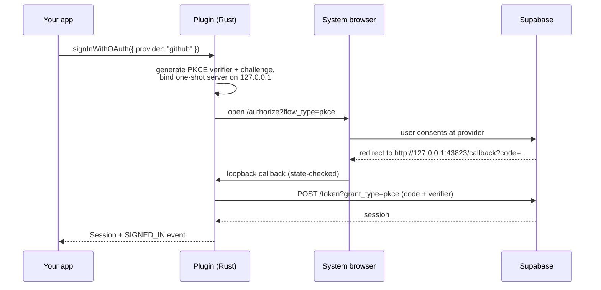

A desktop app has no web server for a provider to redirect to, and Google and GitHub both reject custom URI schemes as redirect targets. The plugin uses the provider-sanctioned native pattern instead: open the system browser, listen on a loopback port, exchange the code with PKCE.

```ts
import { signInWithOAuth, cancelOAuthFlow } from "@exegia/plugin-supabase-auth";

const session = await signInWithOAuth({ provider: "github" });
```

## The round-trip



The listener is one-shot and state-checked: it accepts a single callback matching the state parameter it generated, then shuts down.

## Redirect allow-list

The plugin binds the first free port from `oauth.callbackPorts` and asks GoTrue to redirect to `http://127.0.0.1:<port>/callback`. Supabase matches `additional_redirect_urls` **exactly**, so every port you might bind has to be listed.

```toml supabase/config.toml
[auth]
additional_redirect_urls = [
  "http://127.0.0.1:43823/callback",
  "http://127.0.0.1:43824/callback",
  "http://127.0.0.1:43825/callback",
]
```

<Warning>
A missing redirect URL fails after the consent screen, inside GoTrue. It does not come back as a structured `AuthError`, so it surfaces as an unstructured failure — check this list first when a round-trip dies at the redirect.
</Warning>

The provider's own callback URL is different: it points at GoTrue, not at the plugin. See [Provider setup](/plugin/provider-setup).

## Cancelling

While a round-trip is in flight, the plugin holds the loopback listener until the browser returns or `oauth.flowTimeoutSecs` elapses. If the user backs out in your UI, cancel explicitly so the listener closes immediately:

```ts
await cancelOAuthFlow();
```

The pending `signInWithOAuth()` call rejects with `oauthFlowInterrupted`. `<SocialButtons />` and `<LinkedAccounts />` already wire this to a Cancel action.

## Linking versus signing in

`signInWithOAuth()` establishes a new session. `linkIdentity()` runs the same round-trip authenticated as the current user, so the provider identity is attached to the existing account rather than creating a second one.

If the identity already belongs to another account, the call rejects with `identityAlreadyLinked` and the current account is left untouched.

Linking needs `enable_manual_linking = true` on the project and the `allow-link-identity` [permission](/plugin/permissions).
